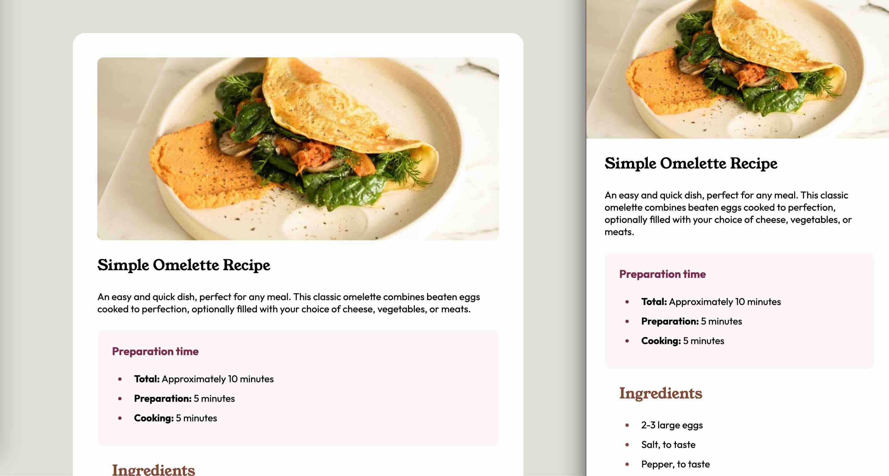

# Frontend Mentor - Recipe page solution

This is a solution to the [Recipe page challenge on Frontend Mentor](https://www.frontendmentor.io/challenges/recipe-page-KiTsR8QQKm).

## Table of contents

- [Overview](#overview)
  - [Screenshot](#screenshot)
  - [Links](#links)
- [My process](#my-process)
  - [Built with](#built-with)
  - [What I learned](#what-i-learned)
- [Author](#author)

## Overview

### Screenshot

### Links

- Solution URL: [Add solution URL here](https://github.com/ikokolius/recipe-page)
- Live Site URL: [Add live site URL here](https://ikokolius.github.io/recipe-page/)

## My process

### Built with

- Semantic HTML5 markup
- CSS custom properties

### What I learned

I learned that I could make image responsive with aspect-ratio.

## Author

- Frontend Mentor - [Iryna Kokolius](https://www.frontendmentor.io/profile/ikokolius)
- LinkedIn - [Iryna Kokolius](https://www.linkedin.com/in/iryna-kokolius/)
